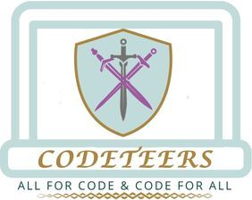

Welcome Samuel Parker,

**Samuel, Ted, Ahmed, Hackathon 1: Staying Safe Online. June 2024**

**Team Name: The Three Codeteers**

A group project from the Code Institute for Hackathon 1. Creating a website guide to staying safe online. The project aim to is to create a front end website utilising HTML, CSS and we have decided to also use some Bootstrap. The website should be responsive on all devices. 

# Contents
1. Public Trello Board
2. Live Github Repo
3. Wireframes / Mockups
5. Features
6. Features to Implement
7. Testing
8. Deployment
9. Credits

# 1. Public Trello Board
https://trello.com/b/owCtF6mD/3-codeteers-staying-safe-online

# 2. Live Github Repo 
https://samuelparkertech.github.io/WWBC-3CODETEERS-HACK1/

# 3. Website MockUps/Wireframes
Basic designs for the pages created in Canva. 

# 4. Features
In this section, you should go over the different parts of your project, and describe each in a sentence or so. You will need to explain what value each of the features provides for the user, focusing on who this website is for, what it is that they want to achieve and how your project is the best way to help them achieve these things.

***NEED TO ADD IMAGES ***

Navigation Bar - Main topper , links to the other 3 pages with a notifier of which page you are currently browsing. Visible on all pages.
Header - Welcome platform to all pages including 'team logo' 'hero' image using our design scheme. 
Staying Safe Online Page - Content including what dangers we face online, common issues and scams. 
Best Practice Page - Content here detailing best practices and how to avoid online issues. Includes images and text. 
Resources Page - Links and more information on how to stay safe online. 
Footer - Social links and team details featured at the bottom of the page. Visible on all pages.

Colour Scheme:
Purple - a359a0
Brown - ae853e
Aqua - c1dbda

# 6.Features Left to Implement
If time allows we would like to add more video content on each page. Improved styling and responsiveness.

# 7.Testing
We have rigorously tested and checked the live site as we have worked. Issues have been resolved and remedied at mentioned. All links are currently working and going to the correct places. 
Live site testing : https://samuelparkertech.github.io/WWBC-3CODETEERS-HACK1/index.html
This includes validator testing. 

# Validator Testing
HTML
No errors were returned when passing through the official W3C validator
CSS
No errors were found when passing through the official (Jigsaw) validator
Unfixed Bugs
You will need to mention unfixed bugs and why they were not fixed. This section should include shortcomings of the frameworks or technologies used. Although time can be a big variable to consider, paucity of time and difficulty understanding implementation is not a valid reason to leave bugs unfixed.

# 9.Credits
Authors of the Project -
Samuel Parker (lead) - https://github.com/SamuelParkerTech
Ted Aylmer - https://github.com/Tedbot2000
Ahmed Alvi - https://github.com/coder-alvi

# 10. Content Credit
Images for Hackers from 
Social Icons from Font Awesome (code was adopted from the Love Rosie Porject)
Navbar is a Bootstrap framework
Logo was created using Canva
Mockups were created using Canva
Fonts from Google Fonts

# Other General Project Advice
We struggled a bit with Github forks and forking, although we were able to resolve this. As our first time it was a bit daunting. 
I (Samuel) struggled with Github Projects page as I had not used this before, I used Trello as an alternative as I have experience of viewing these boards before. 
